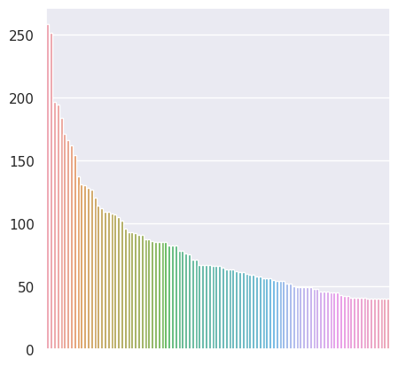
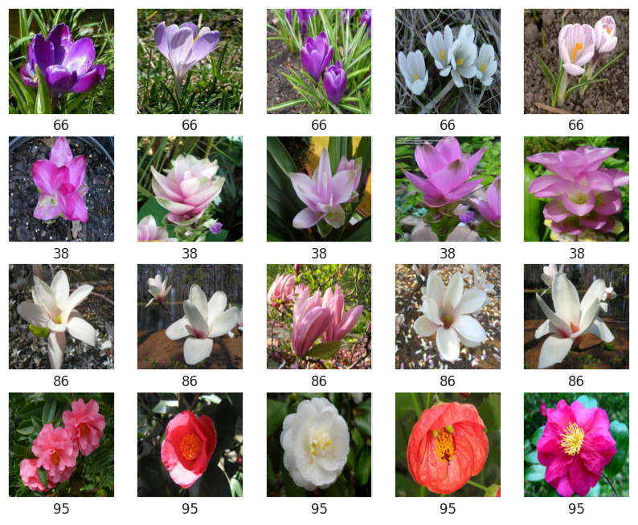
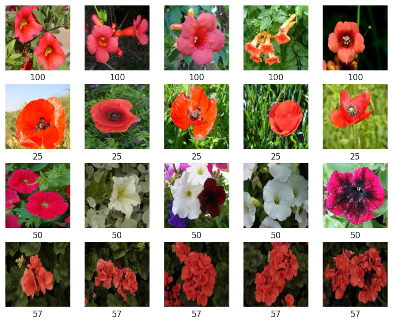
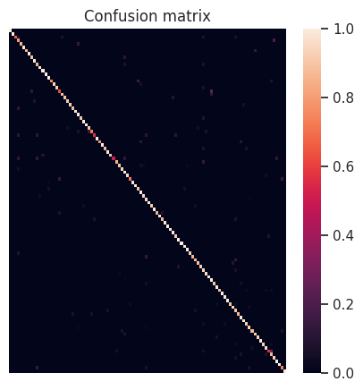
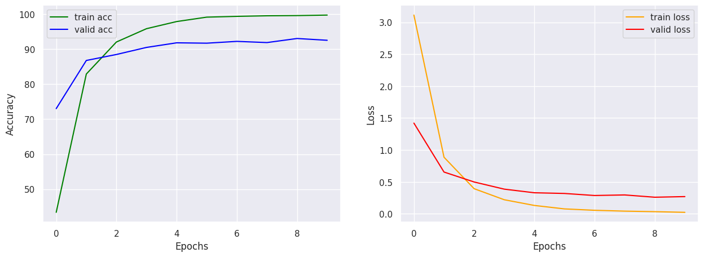

# 102 Flower Classification

## Overview
This project aims to finetune a Resnet50 model to classify flower that are commonly occuring in the United Kingdom. [Previous study](https://www.robots.ox.ac.uk/~vgg/publications/2008/Nilsback08/) utilized SVM and combination of features to achieved 72.8% accuracy. This project show that a **93.04%** accuracy can be achieved  with a more sophisticated deep learning model.

## Data Understanding
The [dataset](https://www.robots.ox.ac.uk/~vgg/data/flowers/102/index.html) contain 8189 images and 102 classes. Each class consists of between 40 and 258 images.

As the description from the [dataset](https://www.robots.ox.ac.uk/~vgg/data/flowers/102/index.html)  
>Each images have large scale, pose and light variations. In addition, there are categories that have large variations within the category and several very similar categories.

- Flower might have color throughout its lifespan
- Flower can deform in many ways
- Many types of flower have similar shape and color

## Methods
A Resnet50 that pretrained on  [IMAGENET1K_V2](https://pytorch.org/vision/stable/models.html) are used. To fit data into the model, images are resize and normalized. The FC layer are replaced so it can produces score for each class(102). Layers other than the FC layer are freezed.

## Performance
Predictions were evaluated using [balanced accuracy](https://scikit-learn.org/stable/modules/generated/sklearn.metrics.balanced_accuracy_score.html). The model achieved **93.04%** accuracy after 10 epoch of training. The model is trained in Google Colab with T4 GPU.

## Next Steps
- Deal with overfitting problem (i.e. data augmentaion, L2 regularization, learning rate scheduler)
